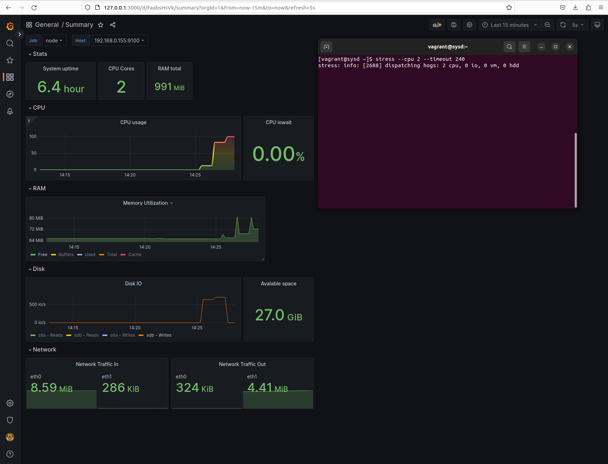

# Мониторинг производительности, Prometheus 

## Задача
Настроить дашборд с 4-мя графиками
- память;
- процессор;
- диск;
- сеть.

Настроить на одной из систем:
- zabbix (использовать screen (комплексный экран);
- prometheus - grafana.

## Выполнение

Объект мониторинга поднимается с помощью [Vagrant файла](./Vagrantfile). 

Node explorer ставится [provision скриптом](./scripts/init.sh)

Стек prometheus \ grafana поднимается в контейнерах. Файл [docker-compose.yml](./monitoring/docker-compose.yml). Для задания логина \ пароля Grafana используется [.env файл](./monitoring/.env)

Dashboard экспортировал в [json файл](./monitoring/grafana/provisioning/dashboards/Summary.json). Подгружается при запуске контейнера.

